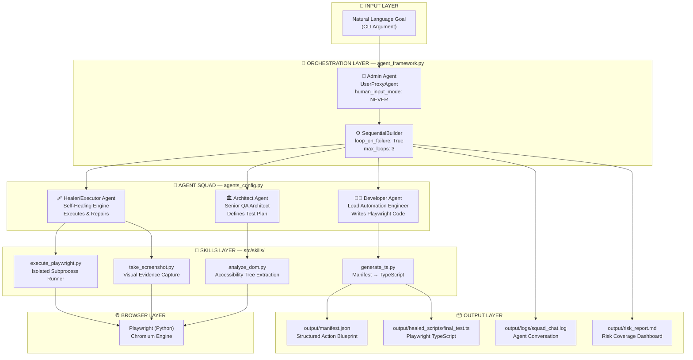
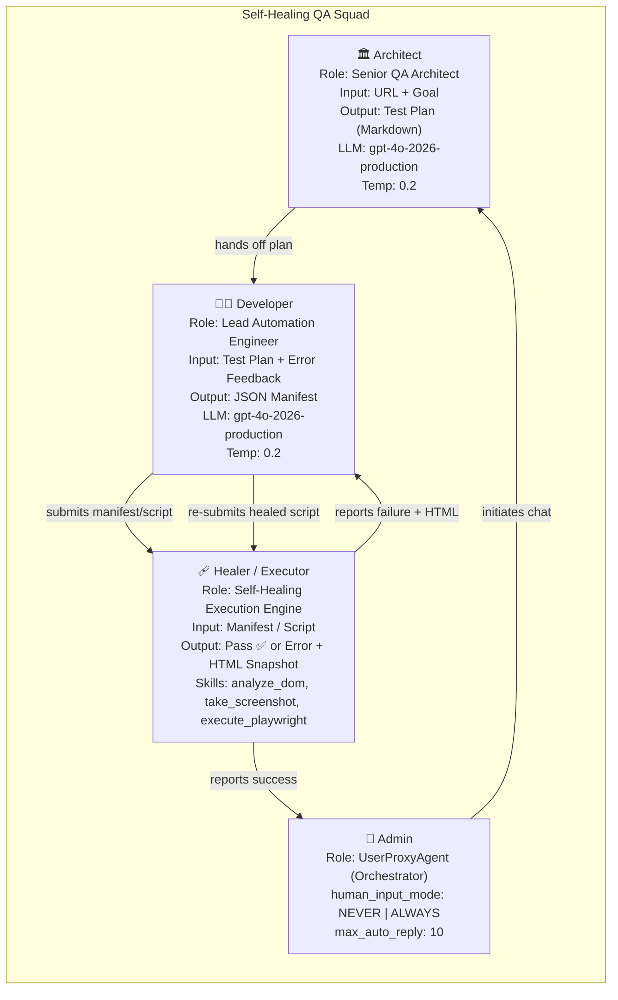
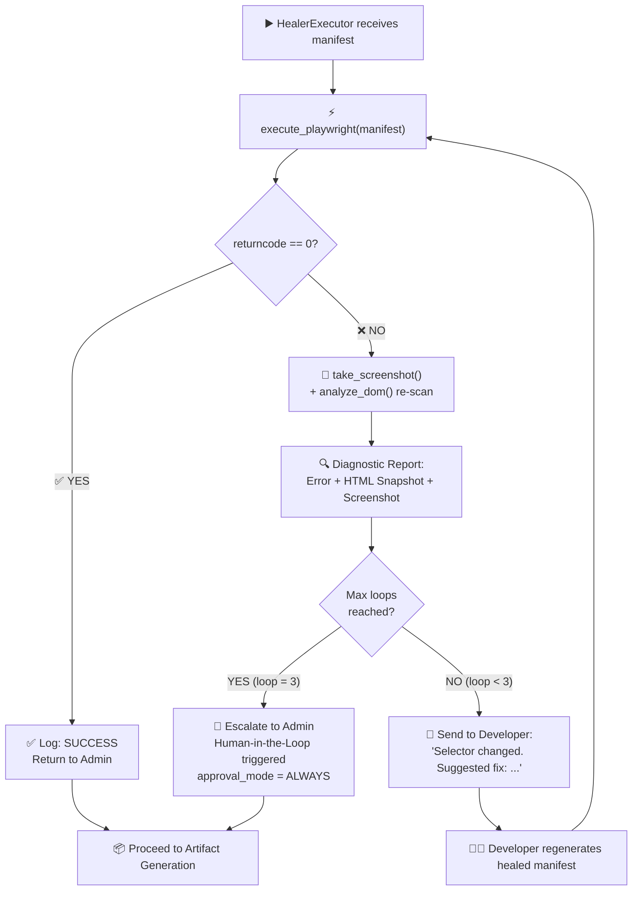
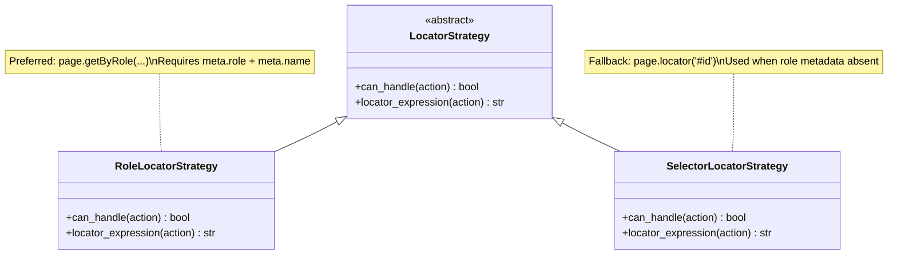
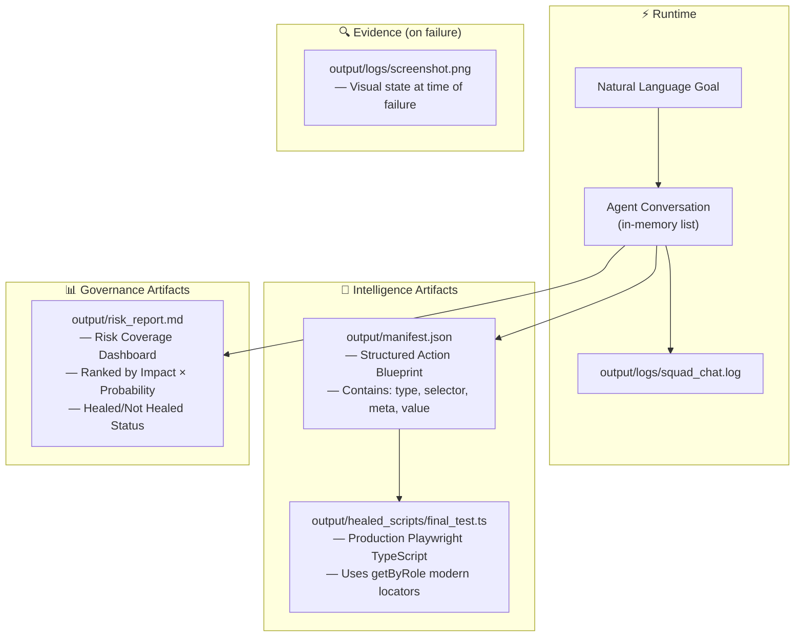
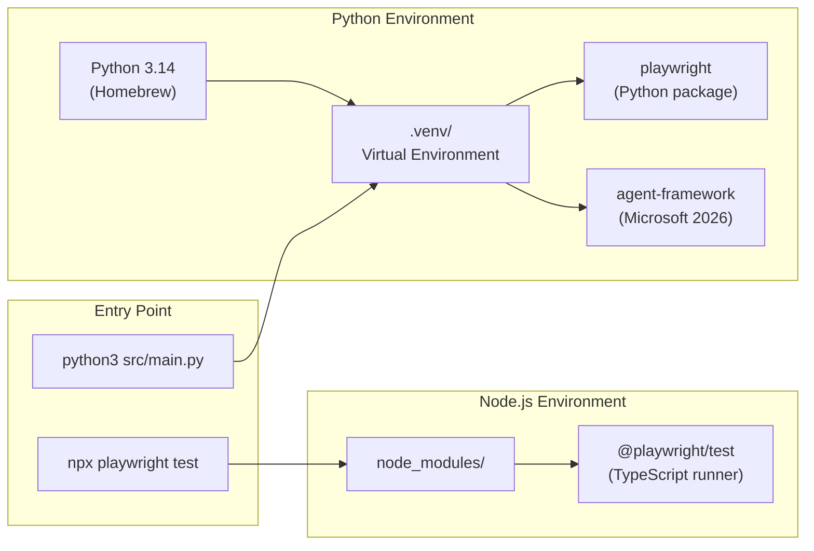
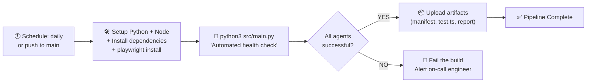

# 🧠 Agentic QA Lab — Solution Architecture Documentation

> **Version:** 2.0 — 2026 Edition (Staff Engineer Refactor)  
> **Paradigm:** Quality Engineer 2.0 — Orchestrating Intelligence, Not Writing Scripts  
> **Stack:** Python 3.14 · Playwright · Agent Framework · TypeScript · Manifest-Driven Architecture · Page Object Model

---

## Table of Contents

1. [Executive Summary](#1-executive-summary)
2. [System Architecture Overview](#2-system-architecture-overview)
3. [Agent Topology](#3-agent-topology)
4. [Solution Flow — End-to-End](#4-solution-flow--end-to-end)
5. [Manifest-Driven Code Generation Pipeline](#5-manifest-driven-code-generation-pipeline)
6. [Self-Healing Loop Logic](#6-self-healing-loop-logic)
7. [Design Patterns](#7-design-patterns)
8. [Component Breakdown](#8-component-breakdown)
9. [Data Flow & Artifact Lifecycle](#9-data-flow--artifact-lifecycle)
10. [Skills Catalogue](#10-skills-catalogue)
11. [Output Artifacts](#11-output-artifacts)
12. [Environment & Dependency Architecture](#12-environment--dependency-architecture)
13. [CI/CD Integration](#13-cicd-integration)
14. [Design Principles & Decision Log](#14-design-principles--decision-log)

---

## 1. Executive Summary

The **Agentic QA Lab** is a next-generation Quality Engineering framework that replaces hand-written test scripts with **autonomous AI agent orchestration**. Inspired by the stabilisation of the Microsoft Agent Framework in 2026, the system enables a single human operator to describe a testing goal in natural language, while three specialist AI agents collaboratively:

- **Analyse** the live DOM of the target application.
- **Record** a structured JSON manifest of actions, locators, and metadata.
- **Synthesise** a production-grade Playwright TypeScript test suite.
- **Verify** manifest integrity against the live DOM.
- **Self-heal** if UI changes cause selector failures — without human intervention.

This represents a fundamental shift from *"writing scripts"* to *"orchestrating intelligence."*

---

## 2. System Architecture Overview



---

## 3. Agent Topology



### Agent Responsibility Matrix

| Agent | Primary Role | Input | Output | Skills |
|:--- |:--- |:--- |:--- |:--- |
| **Architect** | Site Analysis & Test Planning | URL + Natural Language Goal | Structured Test Plan (Markdown) | `analyze_dom` |
| **Developer** | Code Synthesis | Test Plan / Error Feedback | JSON Action Manifest | `generate_ts` |
| **Healer/Executor** | Execution & Self-Healing | Manifest / Script | Pass/Fail + Error Snapshot | `execute_playwright`, `take_screenshot`, `analyze_dom` |
| **Admin** | Orchestration & Governance | Natural Language Goal | Controls loop lifecycle | — |

---

## 4. Solution Flow — End-to-End

```mermaid
sequenceDiagram
    actor Human as 👤 Human / CI Runner
    participant Main as main.py
    participant Admin as Admin Agent
    participant Arch as Architect Agent
    participant Dev as Developer Agent
    participant Heal as Healer / Executor
    participant Browser as Playwright Browser

    Human->>Main: python3 src/main.py "Test login on https://saucedemo.com"
    Main->>Admin: Instantiate agents + register skills
    Admin->>Arch: "Our goal is: ... Analyze the site."

    rect rgb(30, 50, 80)
        Note over Arch,Browser: PHASE 1 — Site Intelligence
        Arch->>Browser: analyze_dom(url) → Launches headless Chromium
        Browser-->>Arch: Accessibility tree (buttons, inputs, links)
    end

    rect rgb(30, 70, 50)
        Note over Dev: PHASE 2 — Manifest Recording
        Arch->>Dev: Hands off structured test plan
        Dev->>Dev: Record JSON manifest of actions + locators + meta
    end

    rect rgb(70, 40, 40)
        Note over Heal,Browser: PHASE 3 — Verification & Healing Loop
        Dev->>Heal: Submit manifest
        Heal->>Browser: execute_playwright(manifest_actions)
        alt SUCCESS ✅
            Browser-->>Heal: "Products" text found
            Heal->>Admin: Execution verified
        else FAILURE ❌ (e.g., selector not found)
            Browser-->>Heal: Error + Stack Trace
            Heal->>Browser: take_screenshot() → visual evidence
            Heal->>Browser: analyze_dom() → fresh HTML snapshot
            Heal->>Dev: "Selector #checkout changed to .proceed-btn. Fix needed."
            Dev->>Heal: Re-submit healed manifest
        end
    end

    rect rgb(50, 40, 70)
        Note over Main: PHASE 4 — Artifact Generation
        Main->>Main: Extract JSON manifest from agent response
        Main->>Main: generate_ts(manifest) → final_test.ts
        Main->>Main: Save manifest.json, squad_chat.log
        Main->>Main: generate_risk_report() → risk_report.md
    end

    Main-->>Human: ✅ All artifacts saved to output/
```



---

## 5. Manifest-Driven Code Generation Pipeline

The core architectural innovation is the **separation of intent (manifest) from implementation (code)**.

```mermaid
flowchart LR
    NL["💬 Natural Language\nGoal"] -->|"parsed by"| ARCH["🏛️ Architect\nLive DOM Analysis"]
    ARCH -->|"inspects"| DOM["🌐 Live Browser\nAccessibility Tree"]
    DOM -->|"feeds"| DEV["👨‍💻 Developer\nManifest Recorder"]

    DEV --> MAN

    subgraph MAN["📋 JSON Manifest (output/manifest.json)"]
        direction TB
        A1["type: navigate\nurl: https://saucedemo.com"]
        A2["type: fill\nselector: #user-name\nmeta: role=textbox, name=Username"]
        A3["type: fill\nselector: #password\nmeta: role=textbox, name=Password"]
        A4["type: click\nselector: #login-button\nmeta: role=button, name=Login"]
        A5["type: assert_text\ntext: Products"]
    end

    MAN -->|"consumed by"| GTS["⚙️ generate_ts.py\nTypeScript Synthesiser"]

    subgraph TS["📄 Playwright TypeScript (final_test.ts)"]
        direction TB
        T1["import { test, expect } from '@playwright/test'"]
        T2["await page.goto('https://saucedemo.com')"]
        T3["await page.getByRole('textbox', { name: 'Username' }).fill(...)"]
        T4["await page.getByRole('button', { name: 'Login' }).click()"]
        T5["await expect(page.locator('body')).toContainText('Products')"]
    end

    GTS --> TS
```



### Why Manifest-Driven?

| Concern | Direct Code Generation | Manifest-Driven |
|:--- |:--- |:--- |
| **Auditability** | Must read code to understand intent | Read JSON manifest in seconds |
| **Multi-language** | Re-generate for each language | One manifest → Python, TypeScript, Cypress |
| **Governance** | Hard to diff AI-generated code | Easy to diff JSON action sequences |
| **Self-healing** | Must re-parse broken code | Patch specific action objects in manifest |
| **Token efficiency** | Sends full code to LLM for review | Send compact manifest for validation |

---

## 6. Self-Healing Loop Logic



> [!NOTE]
> The `SequentialBuilder` is configured with `loop_on_failure=True` and `max_loops=3`. This means the squad will attempt up to 3 autonomous self-healing iterations before escalating to a human for review.

---

## 7. Design Patterns

Four industry-standard design patterns are applied to produce maintainable, extensible, and testable code.

### Pattern 1 — Page Object Model (POM)

The generator produces **two TypeScript files** per test run instead of one flat script. This is the industry standard for scalable Playwright test suites.

```
output/healed_scripts/
├── LoginPage.ts          ← Page Object class  (encapsulates interactions)
└── login_flow.spec.ts    ← Spec file          (imports POM, declares test)
```

**`LoginPage.ts` (Generated Page Object):**
```typescript
import { Page, expect } from '@playwright/test';

/**
 * LoginPage — Auto-generated Page Object
 * Goal: Test the login flow on https://saucedemo.com
 * Generated by Agentic QA Lab v1.0
 */
export class LoginPage {
  constructor(private readonly page: Page) {}

  async performActions(): Promise<void> {
    await this.page.goto('https://saucedemo.com');
    await this.page.getByRole('textbox', { name: 'Username' }).fill('standard_user');
    await this.page.getByRole('textbox', { name: 'Password' }).fill('secret_sauce');
    await this.page.getByRole('button', { name: 'Login' }).click();
    await expect(this.page.locator('body')).toContainText('Products');
  }
}
```

**`login_flow.spec.ts` (Generated Spec):**
```typescript
import { test, expect } from '@playwright/test';
import { LoginPage } from './LoginPage';

test('Test the login flow on https://saucedemo.com', async ({ page }) => {
  const loginPage = new LoginPage(page);
  await loginPage.performActions();
});
```

---

### Pattern 2 — Strategy Pattern (Locator Resolution)

`generate_ts.py` uses a **Strategy registry** to determine how to build a TypeScript locator from a manifest action. New locator types can be added by implementing `LocatorStrategy` without modifying the generator.



**Resolution Order:** `RoleLocatorStrategy` → `SelectorLocatorStrategy` (first match wins).

---

### Pattern 3 — Builder Pattern (TypeScript Source Generation)

`TypeScriptBuilder` replaces f-string concatenation with a **fluent API** that builds the TypeScript file line by line with proper indentation tracking. The final string is only rendered on `.build()`.

```python
# Before (f-string concatenation — fragile, error-prone)
ts_code += f"    await page.getByRole('{role}', {{ name: '{name}' }}).fill('{value}');\n"

# After (TypeScript Builder — typed, clean, testable)
builder.fill(_resolve_locator(action), action.get("value", ""))
```

---

### Pattern 4 — Context Manager / Resource Pooling (Browser Session)

`BrowserSession` implements the **Context Manager** pattern to eliminate redundant browser launches. Both `analyze_dom` and `take_screenshot` previously opened their own browser instance even when called against the same URL.

```python
# Before: two separate browser launches
analyze_dom(url)      # launches browser 1
take_screenshot(url)  # launches browser 2

# After: single shared session
with BrowserSession(url) as page:
    elements = page.evaluate("...")
    page.screenshot(path="...")
```

---

## 8. Component Breakdown


### `src/main.py` — Orchestration Entry Point

```
run_qa_squad(goal, approval_mode)
│
├── Instantiate: architect, developer, healer, admin
├── register_skills() → bind analyze_dom, take_screenshot, execute_playwright
├── SequentialBuilder(loop_on_failure=True, max_loops=3)
├── builder.initiate_chat(message)
│
└── Post-Execution:
    ├── Save squad_chat.log
    ├── Parse JSON manifest from agent response
    ├── generate_typescript_from_manifest(manifest) → final_test.ts
    └── generate_risk_report() → risk_report.md
```

### `src/agents_config.py` — Agent Persona Registry

| Setting | Value |
|:--- |:--- |
| LLM Model | `gpt-4o-2026-production` |
| Temperature | `0.2` (low randomness, deterministic output) |
| API Key Source | `OPENAI_API_KEY` environment variable |
| Admin Input Mode | `NEVER` (fully autonomous) / `ALWAYS` (governance mode) |
| Max Auto Replies | `10` |

### `src/agent_framework.py` — Framework Abstraction Layer

The framework adapter translates the 2026 Agent Framework API into the orchestration loop. It provides:
- `AssistantAgent` — LLM-backed reasoning agent.
- `UserProxyAgent` — Orchestrator with execution authority.
- `SequentialBuilder` — Sequential multi-agent workflow engine with failure loop support.

> [!IMPORTANT]
> This layer is currently implemented as a **high-fidelity mock** that executes real Playwright skills. To deploy with a live LLM, replace this file with the actual `agent-framework` package bindings while keeping the same class interface.

---

## 8. Data Flow & Artifact Lifecycle



---

## 9. Skills Catalogue

Skills are atomic, single-purpose tools registered to agents. They are the **hands** of the AI squad — the only components that interact with the real world.

### `analyze_dom(url: str) → list[dict]`
**Purpose:** Extracts the complete interactive surface of a page as a structured list.  
**How it works:** Launches a headless Chromium browser, navigates to the URL, and runs a JavaScript evaluation to collect all `button`, `a`, `input`, and `select` elements, capturing `tag`, `text`, `role`, `id`, and `className`.  
**Used by:** Architect Agent (site intelligence), Healer Agent (re-scan on failure).

```python
# Sample output
[
  {"tag": "INPUT", "text": "", "role": "n/a", "id": "user-name", "className": "input_error form_input"},
  {"tag": "BUTTON", "text": "Login", "role": "n/a", "id": "login-button", "className": "submit-button btn_action"}
]
```

---

### `take_screenshot(url: str, output_path: str) → str`
**Purpose:** Captures a full-page screenshot as visual evidence of the UI state.  
**How it works:** Launches headless Chromium, navigates to the URL, and saves a PNG.  
**Used by:** Healer Agent (evidence capture on failure).

---

### `execute_playwright(code: str) → str`
**Purpose:** Runs an arbitrary Playwright Python script in an isolated subprocess and returns its stdout/stderr.  
**How it works:**
1. Writes `code` to a temporary `.py` file via `tempfile.NamedTemporaryFile`.
2. Spawns a subprocess using `sys.executable` (same Python interpreter) to guarantee the `.venv` is used.
3. Passes `PYTHONPATH` from the parent process so the subprocess can resolve `playwright`.
4. Captures `stdout`/`stderr` and returns a structured result string.
5. Always cleans up the temp file in the `finally` block.

**Used by:** Healer/Executor Agent.

---

### `generate_typescript_from_manifest(manifest: dict) → str`
**Purpose:** Transpiles a JSON manifest of test actions into Playwright TypeScript source code.  
**How it works:** Iterates over the `actions` array in the manifest and emits TypeScript statements based on `type`:

| Action Type | TypeScript Emitted |
|:--- |:--- |
| `navigate` | `await page.goto('...')` |
| `fill` (with role meta) | `await page.getByRole('textbox', { name: '...' }).fill('...')` |
| `fill` (fallback) | `await page.locator('selector').fill('...')` |
| `click` (with role meta) | `await page.getByRole('button', { name: '...' }).click()` |
| `click` (fallback) | `await page.locator('selector').click()` |
| `assert_text` | `await expect(page.locator('body')).toContainText('...')` |

> [!TIP]
> Role-based locators (`getByRole`) are always preferred over CSS selectors when `meta.role` and `meta.name` are present. This makes the generated tests resilient to CSS class changes — a key self-healing property.

---

## 10. Output Artifacts

After every squad run, the following artifacts are written to the `output/` directory:

```
output/
├── manifest.json              ← JSON blueprint of all test actions + locators
├── risk_report.md             ← Risk Coverage Dashboard (Markdown)
├── healed_scripts/
│   └── final_test.ts          ← Production Playwright TypeScript test
└── logs/
    ├── squad_chat.log         ← Full agent conversation history
    └── screenshot.png         ← Visual evidence (captured on failure only)
```

### Sample `manifest.json`
```json
{
  "goal": "Our goal is: Test the full purchase journey on https://saucedemo.com...",
  "actions": [
    { "type": "navigate", "url": "https://saucedemo.com" },
    { "type": "fill", "selector": "#user-name", "value": "standard_user",
      "meta": { "role": "textbox", "name": "Username" } },
    { "type": "fill", "selector": "#password", "value": "secret_sauce",
      "meta": { "role": "textbox", "name": "Password" } },
    { "type": "click", "selector": "#login-button",
      "meta": { "role": "button", "name": "Login" } },
    { "type": "assert_text", "text": "Products" }
  ]
}
```

### Sample `final_test.ts`
```typescript
import { test, expect } from '@playwright/test';

test('Test the full purchase journey on https://saucedemo.com', async ({ page }) => {
    await page.goto('https://saucedemo.com');
    await page.getByRole('textbox', { name: 'Username' }).fill('standard_user');
    await page.getByRole('textbox', { name: 'Password' }).fill('secret_sauce');
    await page.getByRole('button', { name: 'Login' }).click();
    await expect(page.locator('body')).toContainText('Products');
});
```

### `risk_report.md` — Risk Coverage Dashboard Schema

| Column | Description |
|:--- |:--- |
| **Area** | The business capability being tested |
| **Status** | ✅ Pass / ❌ Fail |
| **Risk Level** | 🔴 High / 🟡 Medium / 🟢 Low (Impact × Probability) |
| **Healing Status** | 🩹 Healed (self-repaired) / N/A |
| **Notes** | Root cause or success context |

---

## 11. Environment & Dependency Architecture



### Setup Commands

```bash
# Python environment
python3 -m venv .venv
source .venv/bin/activate
pip install agent-framework playwright
playwright install

# Node.js environment (for TypeScript test execution)
npm install -D @playwright/test

# Run the squad
python3 src/main.py "Your testing goal here"

# Execute the generated TypeScript test
npx playwright test output/healed_scripts/final_test.ts --headed
```

> [!WARNING]
> Always use the `.venv` Python interpreter, not the system Python. The system Python at `/opt/homebrew/bin/python3` does not have access to the `.venv` site-packages. The `main.py` entry point automatically resolves this via `sys.path` injection.

---

## 12. CI/CD Integration

The `.github/workflows/agent-ci.yml` enables automated daily health checks:



> [!TIP]
> Set the `OPENAI_API_KEY` as a GitHub Actions secret to enable live LLM inference in CI. Without it, the system runs in mock mode, which is still useful for verifying the pipeline structure.

---

## 13. Design Principles & Decision Log

| Decision | Rationale |
|:--- |:--- |
| **Manifest-first architecture** | Separates *what to test* (manifest) from *how to test it* (code), enabling multi-language output and better auditability. |
| **`getByRole` locators preferred** | Role-based locators are resilient to CSS refactors. They use the accessibility tree, not the visual DOM, matching user intent over implementation detail. |
| **Temperature = 0.2** | Low temperature produces deterministic, structured output — critical for code generation where consistency is more valuable than creativity. |
| **`sys.executable` in subprocess** | Ensures the subprocess uses the same Python interpreter and `.venv` as the parent process, avoiding `ModuleNotFoundError` across different system configurations. |
| **PYTHONPATH propagation** | The `.venv` site-packages path is propagated to subprocesses via `env["PYTHONPATH"]` to guarantee Playwright availability in isolated execution contexts. |
| **`loop_on_failure=True`** | Enables fully autonomous self-healing without human intervention. Capped at `max_loops=3` to prevent infinite loops on irrecoverable failures. |
| **Human-in-the-loop flag** | The `--approve` flag (`human_input_mode = "ALWAYS"`) allows selective governance — full autonomy by default, human oversight on demand. |
| **Risk-ranked dashboard** | Rather than simple pass/fail counts, results are ranked by `Impact × Probability` to help teams prioritise which failures to investigate first. |
| **Framework abstraction layer** | The `agent_framework.py` adapter decouples the squad logic from the underlying framework, making it straightforward to swap the mock for the production `agent-framework` package. |

---

*📄 Generated by Agentic QA Lab — Solution Architecture Documentation*  
*🤖 Quality Engineer 2.0 — Orchestrating Intelligence Since 2026*
